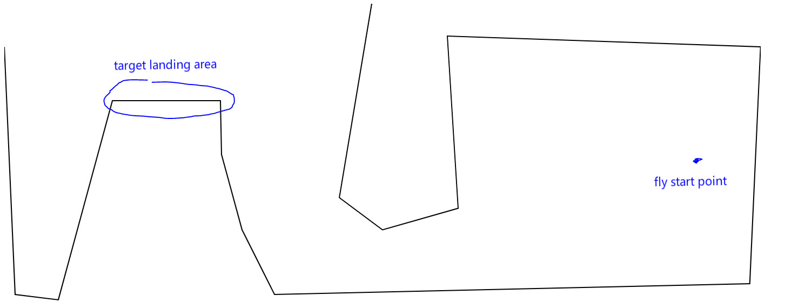
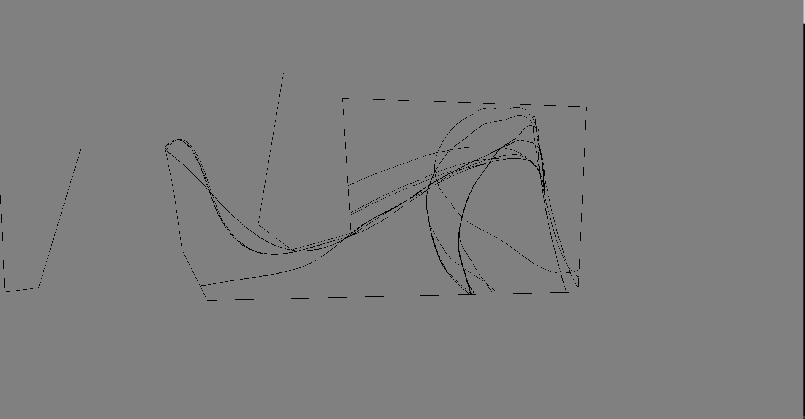

# evolve the spacecraft's landing path on complex land figure
GA project for INFO6205

Our Problem describles how spacecrafts making successful landing on a complex land figure. 

The picture above is the land shape designed by us, using Java Graphics2D and Canvas. Our first generation of spacecrafts(or called landers) starts fly from the start point with an initial power, and its speed & flying direction angle are generated randomly defined by its own chromosome. Due to the gravity, after first flying most of them could have crashed into ground, their fly routes may looks like this:

We define 200 landers as the entire population and seperate them into 4 sub population in order to speed up the crossover progress, each landr has kind of real configurations such like fuel limit, speed, accerlerate rate, flying route points, etc. And such a progress are reapeated many times as the evolution. After each flying, we score those landers based on their performance: if one got closer to the target landing area with appropriate speed, it get higher score; if it crashed somewhere or fly out of the shape, it gets lower score. Then first several best landers are selected and used to breed new landers and replace the worst landers at same time to keep the total number of population at 200. We record their flying routes and visulize it in Canvas. This is how the evolution progress looks like:

After many times of generations, the good landers survived and they keep producing better landers for next generation. Finally some of landers are able to land on target area by 1000 X 1000 times generations in our test:

